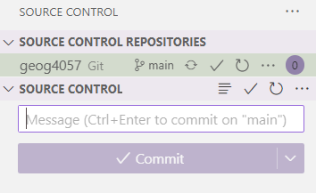

# Overview
This assignment will give you the instruction to set up your assignment repository on github.com and work with git in VSCode.
Submit a report with screen captures of each step in the following instruction:
# Prerequisite
- You need to have both VS Code and git installed on your computer
- If you just installed git and did nothing, you need to run "git config" to set up the git environment
- You only need to run "git config" once
- open a command prompt and run the following code. (replace the name and email with yours)

```
git config --global user.name "John Doe"
git config --global user.email johndoe@example.com

```

# Step 1 Create a gitHub.com repository
- Create a github.com account if you have not (use the email that you used in the git config command)
- In your github.com dashboard, click create a public repository
- Name it "geog4057_yourname"
- Open the repository and click the green "Code" button
- Check the HTTPS url
- Copy the URL to the clipboard for the next step
 
# Open a folder as the workspace
- Find your Documents folder and create a new folder called "programming"
- Run VS Code
- In menu File->Open Folder
- Find the "programming" folder and open it
- The folder is empty for now. 


# Step 2 Synchronize a local repository with github.com
- Press ctrl+shift+p to call the command palette 
- type "git clone"
- Past the URL from Step 1 to here to clone the respository 
- If you are asked to open the clone repository in VS Code, answer "YES"
- Click trust if you see the page like below
-  
-  Now you should have a copy of the repository on your computer and opened by VS Code
-  Check the Source control section in VS Code, it should look like



# Create your first jupyter notebook and synchronize it to github.com

- Make sure you have the extension "jupyter" installed in VS Code
- Use the key combination ctrl+shift+p to call the command palette
- Type create new to find "Create New Jupyter notebook"
- The notebook will be automatically created with the name "untitled-1.ipynb"
- Ctrl-s or in the menu->File->Save, to save the notebook to your current folder
- In the notebook, click "Kernels" and select "ArcPyClone" (the one you did in the first assignment) as the kernel
- In the first cell, try to run the following code:

```
import arcpy
print(arcpy.GetInstallInfo()['Version'])
```
- The notebook has been saved by VS Code. It should have an "U" letter next to it in the Explorer window
- These are uncommitted changes
- Click Source Control
- Type some message in the Commit message box


- Click Commit
- Click the Sync Changes button to synchronize the changes to the server


