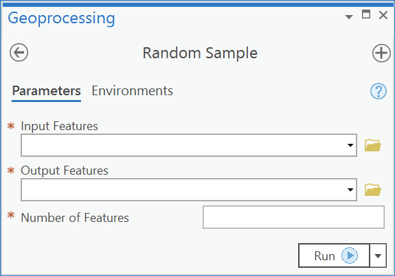
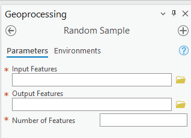

# Create a script tool and python toolbox for random sampling

A script tool or sometimes referred to as a "Python script tool", uses a single python script (.py) to execute the funcionality coded by a user. The appearance of the tool, including label, alias, and input and output are all handled by the ArcGIS Pro geoprocessing framework. User only focuses on using the input and output parameters obtained from the user interface provided by ArcGIS Pro geoprocessing framework.

A python toolbox is defined by a python script file with an extension of .pyt. In the pyt file, users define the input and output arguments and the behavior of the toolbox and the tools in the toolbox. It provides a more flexible coding features for the user to customize the toolbox and tools. 

In this exercise, you will start with a python script tool called "Random Sample" and then construct a similar toolbox with the function to generate a random subset of input feature class



## Create a script tool

### Create a new script in a toolbox

- In the ArcGIS Pro catalog, find Toolboxes and find the default toolbox of the project.
- Right-click it and New->Script
- Change the Name to "RandomSample" and Label to "Random Sample". Note that you cannot put space in the name as you can do for the label.

### Update the parameters

- Click on the Parameters tab
- In the first row (row 0), put the label as "Input Features", Name as "Input_Features", Data Type as "Feature Layer", Type as "Required"," Direction as "Input"
- In the second row (row 1), put Output Features, Output_Features, Feature Layer, Required, Output
- In the third row (row 2), put Number of Features, Number_of_Features, Long, Required, Input
- Click the Filter box of the third parameter, and select Range
- Put 1 as Minimum and 100000 as maximum
- Click Ok to close the script defintion window
- In the catalog pane, find the "Random Sample" script tool and double click on it.
- Do you see the parameter interface you just defined? Capture the screen of it.



### Edit the script

- Reopen the script tool for editing by right-clicking it and Properties
- Click on the Execution tab
- Click "Open in Script Editor"
- What script editor was opened? 
- Optional: you can go to the environment setting to change the default editor if you need to.

> Go to Menu->Project->Options, check the Geoprocessing tab. 
> If the box is empty, you can click the open button to locate a your python editor.
>
> For example, if you want to use VS Code, with VS Code running, right-click on the task bar of Windows, and call the Task Manager. Expand Visual Studio Code and right click on any Visual Studio Code process and select "Open file location". Once you know the location, you can use the open button in the ArcGIS python editor option box to find the program.
>
> You may need to restart the ArcGIS Pro app to make the change effective.


- Use the code editor of your choice, create a new script named "randomsample.py" and save it to your project folder
- Copy and paste the following code in there:

```python
import arcpy
import random
# Set inputs and outputs. Inputfc can be a shapefile or geodatabase
# feature class. Outcount cannot exceed the feature count of inputfc.
inputfc = arcpy.GetParameterAsText(0)
outputfc = arcpy.GetParameterAsText(1)
outcount = arcpy.GetParameter(2)
# Create a list of all the IDs of the input features.
inlist = []
with arcpy.da.SearchCursor(inputfc, "OID@") as cursor:
    for row in cursor:
        id = row[0]
        inlist.append(id)
# Create a random sample of IDs from the list of all IDs.
randomlist = random.sample(inlist, outcount)
# Use the random sample of IDs to create a new feature class.
desc = arcpy.da.Describe(inputfc)
fldname = desc["OIDFieldName"]
sqlfield = arcpy.AddFieldDelimiters(inputfc, fldname)
sqlexp = f"{sqlfield} IN {tuple(randomlist)}"
arcpy.Select_analysis(inputfc, outputfc, sqlexp)
```

- In the Execution tab, next to the Script File box, click the open button.
- Locate randomsample.py and select it
- Click ok to close it

### Test the script tool

- In the catalog pane, locate the Random Sample tool and run it
- For the Input Features, select any feature class you have
- For the Output Features, select a geodatabase and put the name of "random_Select" for the feature class
- In number of Features, put 100 (or any number that makes sense)
- Click Run. 
- Screen capture the map with the random_Select layer in it that was created by the script tool

### Add messages to the tool

- The current tool does not generate any messages for the users to read. 
- Add some messages might be helpful
- Reopen the script tool for editing. Open the script. Add the following lines to the end of the script

```python
arcpy.AddMessage("{0} random features selected from {1}".format(outcount,inputfc))
```

- Run the tool again. After it, click "View Details" to check if the message was added to the Message list.
- Capture the screep of the message

## Create a python toolbox

Next, you will create a new python toolbox for the same functionality and interface

### New toolbox

- Right-click on  catalog -> Toolboxes, and New Python Toolbox
- Give the new toolbox name "RandomSample_toolbox.pyt"
- Right-click on the toolbox and Edit - this should bring up the default code editor

### Edit the Tool labels and parameters

- Modify the class toolbox(object) as:

```python
class Toolbox(object):
    def __init__(self):
        self.label = "Random Sampling Tools"
        self.alias = "randomsampling"
```

- Change  "class Tool (Object)" to "class RandomSampleTool(Object)"
- With the tool class name change, you should also change the "self.tools = [Tool]" of the Toolbox class to "self.tools = [RandomSampleTool]
- In the \__init\__() function of RandomSampleTool, change self.label = "Tool" to self.label = "Random Sampling Tool"

```python
class Toolbox(object):
    def __init__(self):
        self.label = "Random Sampling Tools"
        self.alias = "randomsampling"
        # List of tool classes associated with this toolbox
        self.tools = [RandomSampleTool]

class RandomSampleTool(object):
    def __init__(self):
        """Define the tool (tool name is the name of the class)."""
        self.label = "Random Sampling Tool"
        self.description = ""
        self.canRunInBackground = False
```

- Copy the following code to rewrite the "def getParameterInfo(self):" function (note: when copying to your code, make sure the indentation is correct)

```python
    def getParameterInfo(self):
        """Define parameter definitions"""
        input_features = arcpy.Parameter(
            name="input_features",
            displayName="Input Features",
            datatype="GPFeatureLayer",
            parameterType="Required",
            direction="Input")
        output_features = arcpy.Parameter(
            name="output_features",
            displayName="Output Features",
            datatype="GPFeatureLayer",
            parameterType="Required",
            direction="Output")
        no_of_features = arcpy.Parameter(
            name="number_of_features",
            displayName="Number of Features",
            datatype="GPLong",
            parameterType="Required",
            direction="Input")
        no_of_features.filter.type = "Range"
        no_of_features.filter.list = [1, 100000]
        parameters = [input_features, output_features, no_of_features]
        return parameters
```

- Save the script
- In the catalog pane, right click the toolbox and refresh to update the toolbox and tools
- Double click the Random Sampling Tool to run it. 
- Make a screen capture of the interface

### Edit the tool execution

- Copy the following code to update the execute(self,parameters,messages): function

```python
    def execute(self, parameters, messages):
        inputfc = parameters[0].valueAsText
        outputfc = parameters[1].valueAsText
        outcount = parameters[2].value
        inlist = []
        with arcpy.da.SearchCursor(inputfc, "OID@") as cursor:
            for row in cursor:
                id = row[0]
                inlist.append(id)
        randomlist = random.sample(inlist, outcount)
        desc = arcpy.da.Describe(inputfc)
        fldname = desc["OIDFieldName"]
        sqlfield = arcpy.AddFieldDelimiters(inputfc, fldname)
        sqlexp = f"{sqlfield} IN {tuple(randomlist)}"
        arcpy.Select_analysis(inputfc, outputfc, sqlexp)
        return

```

- Before running the tool, you need to add one more line at the top section of the script: "import random". If not, the script will give an error message
- Save the script
- Double click the Ranom Sampleing Tool to run
- Screen capture the toolbox and the result map of your tool's output

### Add the tool message

- In the function execute, add one line before the line "return". Again, when pasting the code into the function, take care of the identation

```python
messages.addMessage("{0} random features selected from {1}".format(outcount,inputfc))
```

- Run the tool again and check if the message was returned by the tool 
- Capture the screen of the message

## Summarize

- In a paragraph or two, summarize your experience of coding with both the script tool and the python toolbox in ArcGIS Pro. Compare the similarity and differences between these two features of ArcGIS Pro Geoprocessing framework.